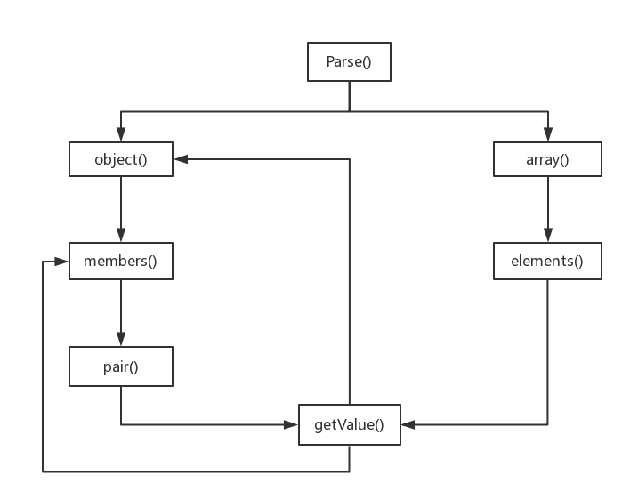

# json parse

## 解析流程


## example

```go
package main

import (
	"fmt"
	"strings"

	jpa "github.com/zhiruchen/json-parse"
	"github.com/zhiruchen/json-parse/parser"
)

func main() {
	jsStr := `{"a":1,"b":2,"c":{"d":[1024.134,1000,1900],"e":"let her go"}}`
	strReader := strings.NewReader(jsStr)
	obj, err := jpa.GetJSONObject(strReader)
	fmt.Printf("obj: %v, err: %v\n", obj, err) // obj: map[b:2 c:map[d:[1024.134 1000 1900] e:let her go] a:1], err: <nil>

	v, err := jpa.GetValue(strings.NewReader(jsStr), "a")
	fmt.Println(v == float64(1), err == nil)

	v, err = jpa.GetValue(strings.NewReader(jsStr), "b")
	fmt.Println(v == float64(2), err == nil)

	v, err = jpa.GetValue(strings.NewReader(jsStr), "c", "d")
	jsArray, ok := v.(parser.JSONArray)
	fmt.Println(ok == true, err == nil)
	fmt.Printf("%T, %v\n", jsArray, jsArray)

	jsStr = `["1","2","3",4,5,6]`
	strReader = strings.NewReader(jsStr)
	array, err := jpa.GetJSONObject(strReader)
	fmt.Printf("array: %v, err: %v\n", array, err) // array: [1 2 3 4 5 6], err: <nil>

	for _, v := range array.(parser.JSONArray) {
		fmt.Printf("%T: %v\n", v, v)
	}

}

/*
obj: map[b:2 c:map[d:[1024.134 1000 1900] e:let her go] a:1], err: <nil>
true true
true true
true true
parser.JSONArray, [1024.134 1000 1900]
array: [1 2 3 4 5 6], err: <nil>
string: 1
string: 2
string: 3
float64: 4
float64: 5
float64: 6
*/
```